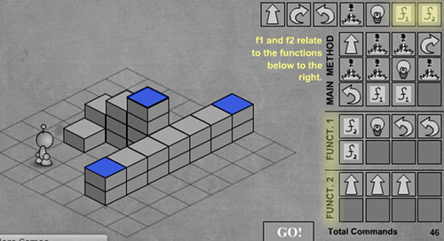

> PROGRAMACION IMPERATIVA - Certified Tech Developer - Digital House - luciano Greco

**EJERCICIO N° 1**
=================

*Instrucciones*
Antes de comenzar cada nivel, te proponemos crear el diagrama de flujo que luego
vas a pasar al lenguaje de LightBot. Por ejemplo, el primer nivel sería:

De manera individual, te proponemos resolver los desafíos del juego.

https://armorgames.com/play/2205/light-bot

