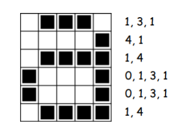

> PROGRAMACION IMPERATIVA - Certified Tech Developer - Digital House - luciano Greco

**EJERCICIO N° 2**
=================
Les proponemos la siguiente actividad para reforzar este concepto

La imagen de arriba nos muestra cómo una imagen puede ser representada por números. La
primera línea consiste de un píxel de color blanco, seguido de tres de color negro, y luego uno de color blanco. De este modo la primera línea se representa como 1, 3, 1. El primer número se refiere siempre al número de píxeles de color blanco. Si el primer pixel es de color negro la línea comenzará con un cero.

Te proponemos hacer el siguiente dibujo con este método

Por último, te retamos a que armes tu propio dibujo y lo pases a un compañero de la mesa. Hagan un intercambio y vean que dibujo pensaron.

Como verás, esta es una forma de transmitir información de manera precisa y concreta. 

Es lo que buscamos con la programación, que aprendan a dar instrucciones precisas para poder ser comprendidos por la computadora.

**RESULTADO**
=================

