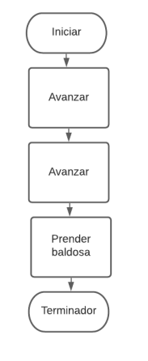

Mesa de trabajo
LightBot es un robot que debemos programar para que encienda las luces de algunas
baldosas especiales por donde camina. La programación se hace mediante símbolos
como flechas.
Objetivo
Con esta ejercitación te proponemos comprender el concepto de algoritmo e
instrucciones, e identificar los elementos del pensamiento computacional.
Instrucciones
Antes de comenzar cada nivel, te proponemos crear el diagrama de flujo que luego
vas a pasar al lenguaje de LightBot. Por ejemplo, el primer nivel sería:

De manera individual, te proponemos resolver los desafíos del juego.
https://armorgames.com/play/2205/light-bot
Cuando tengas alguna duda que te impida avanzar, podés preguntarle a tus
compañeros de Mesa de Trabajo a ver cómo resolvieron. ¡Mucha suerte!
